# project-aiq-mvp

## Main Objective

Build an AI-powered document search system that enables intelligent retrieval, reasoning, and interaction with uploaded documents through a web chat interface.

The system integrates four main components — **Frontend** (web chat UI), **Backend** (API Gateway + session management), **AI Engine** (reasoning), and **Embedding Service** (document vectorization) — to handle user interaction, routing, session management, LLM reasoning with autonomous RAG retrieval, and document search respectively.

---

## Project Structure

```
project-aiq-mvp/
├─ apps/
│  ├─ web/                 # Streamlit chat UI
│  └─ backend/             # NestJS orchestrator API (REST + session & history)
├─ services/
│  ├─ ai-engine/           # AI Engine (CrewAI reasoning, reranker)
│  └─ embedding-service/   # Embedding Service (chunking, embedding, Qdrant)
├─ docker-compose.yml
└─ README.md
```

## Getting Started

To start all services (backend, frontend, AI Engine, Embedding Service) in parallel, run the following command from the root of the monorepo:

```bash
pnpm i -r
pnpm dev
```

## System Architecture Overview

### 1. Frontend (Streamlit)

The frontend is a Streamlit application for the chat user interface.

**Technology:** Python, Streamlit

**Location:** `apps/web/`

---

### 2. Backend (NestJS Orchestrator)

The backend service is a NestJS application that acts as an orchestrator between the frontend and the AI Engine, Chat Service, and Embedding Service. It does not contain any AI logic itself.

**Technology:** NestJS (TypeScript)

**Location:** `apps/backend/`

---

### 3. AI Engine
**Purpose:**  
Handles LLM reasoning and orchestration using CrewAI with autonomous RAG retrieval through internal API calls.

**Responsibilities:**
- Process chat completion requests using multi-agent reasoning (CrewAI)
- Support multiple LLM providers (OpenAI, Anthropic, Google AI, Ollama)
- Route queries intelligently based on user intent
- Request document retrieval via Embedding Service API.
- Generate natural, contextually appropriate responses in the language user asks

**Router Endpoints:**
- `POST /v1/chat/completions` → Chat completion with agent reasoning

**Supported Providers:**
- OpenAI
- Anthropic
- Google AI
- Ollama

**AI Engine Architecture:**

The service uses a 3-agent system with specialized roles:

1. **Orchestrator Agent**
   - Analyzes user queries using LLM reasoning
   - Determines query intent (document search vs general chat)
   - Asks for clarification when user intent is unclear
   - Routes queries to appropriate agents
   - Coordinates workflow between RAG Analyzer and Chat Responder
   - Extensible for future agent types

2. **RAG Analyzer Agent**
   - Analyzes user query to extract search intent
   - Generates optimal search keywords for retrieval
   - Uses **DocumentSearchTool** which:
     - Calls Embedding Service API for semantic vector similarity search
     - Receives documents with similarity scores
     - Automatically reranks retrieved documents to improve precision
   - Passes search results directly to Chat Responder

3. **Chat Responder Agent**
   - Primary agent for communicating with users
   - Receives context from other agents (RAG results or conversation history)
   - Evaluates relevance of retrieved documents to the query
   - Filters out unrelated documents and synthesizes relevant information
   - Generates natural, conversational answers in the language user asks
   - Maintains tone appropriate to query context

**Key Features:**
- **Intelligent Query Routing:** LLM-based intent detection by Orchestrator
- **Autonomous RAG:** DocumentSearchTool provides autonomous API integration for document retrieval from Embedding Service
- **Integrated Reranking:** DocumentSearchTool automatically reranks search results for improved precision
- **Context-Aware Responses:** Agents collaborate to provide relevant answers
- **Natural Language:** Generates conversational responses without technical jargon

**Technology:** Python FastAPI, CrewAI

**Location:** `services/ai-engine/`

---

### 4. Embedding Service
**Purpose:**  
Handles document processing, vector embedding operations, and document search.

**Responsibilities:**
- Chunk documents for optimal retrieval
- Generate and store text embeddings from OCR or raw text
- Perform similarity search using distance metrics (cosine similarity)
- Manage document metadata and CRUD operations
- Own and manage Qdrant vector database (database per service pattern)

**Router Endpoints:**
1. `POST /v1/upload` → Receive, chunk, embed, and store documents
2. `POST /v1/search` → Compute vector distance for document retrieval
3. `GET /v1/documents` → List or fetch available document metadata
4. `POST /v1/query` → Query via metadata or other structured filters
5. `DELETE /v1/delete` → Remove document by ID
6. `PUT /v1/edit` → Update existing document metadata or embedding
7. `GET /v1/get/:id` → Fetch document directly by ID

**Key Design Principle:**
- Embedding Service is the **sole owner** of Qdrant DB
- Other services **must not** access Qdrant directly
- All vector operations go through Embedding Service APIs

**Technology:** Python FastAPI, Qdrant

**Location:** `services/embedding-service/`

---

## Architecture Diagrams

### Container Diagram (C4 Level 2)

```mermaid
graph TD
    %% LAYER: Frontend & Backend
    U[User <br/> <small>Frontend</small>]
    B[Backend API Gateway<br/><small>Routing · Session · History · Auth · Logging</small>]

    %% LAYER: Services
    A[AI Engine<br/><small>Orchestrator · RAG Analyzer · Chat Responder</small>]
    R[Embedding Service<br/><small>Chunker · Embedding · Vector Search</small>]

    %% CONNECTIONS
    U --> B
    B --> A
    B --> R
    A --> R

    %% STYLE
    style U fill:#e1e4e8,stroke:#586069,stroke-width:2px,color:#24292e
    style B fill:#d1ecf1,stroke:#17a2b8,stroke-width:2px,color:#212529
    style A fill:#fff,stroke:#0366d6,stroke-width:2px,color:#24292e
    style R fill:#fff,stroke:#28a745,stroke-width:2px,color:#24292e
```



---

### Document Retrieval Flow

```mermaid
sequenceDiagram
    autonumber
    box Client Layer
        participant User as 🧑‍💻 User (Frontend)
    end

    box Gateway Layer
        participant Backend as 🌐 Backend (API Gateway + Session)
    end

    box AI Engine
        participant Orch as 🧩 Orchestrator Agent
        participant Rag as 🔍 RAG Analyzer Agent
        participant Responder as 💡 Chat Responder Agent
    end

    box Embedding Service
        participant Retrieval as 📚 Retrieval Module
        participant Qdrant as 🗂️ Qdrant DB
    end


    %% USER SEND MESSAGE
    User->>Backend: POST /chat {session_id, message}

    %% BACKEND LOAD HISTORY
    Backend->>Backend: Load session + history from DB
    Backend->>Orch: POST /v1/chat/completions {message, history[]}

    %% ORCHESTRATOR
    Orch->>Orch: Analyze intent (Chat / RAG)

    alt 🔍 Query requires document retrieval
        Orch->>Rag: Forward query for retrieval analysis
        
        %% DOCUMENT SEARCH TOOL ACTION
        Rag->>Retrieval: 🔧 DocumentSearchTool → POST /v1/search {query_text}
        Retrieval->>Qdrant: Vector search (cosine similarity)
        Qdrant-->>Retrieval: Return top-K documents + scores
        Retrieval-->>Rag: Relevant documents[]
        Rag-->>Responder: Forward top-N context for response generation
    else 💬 Simple chat
        Orch->>Responder: Forward message directly
    end

    %% RESPONSE GENERATION
    Responder->>Responder: Evaluate relevance & synthesize information
    Responder->>Responder: Generate final response (LLM)
    Responder-->>Backend: {answer, context}

    %% SAVE & RETURN
    Backend->>Backend: Save message + response
    Backend-->>User: Return final message
```



---

### Document Upload Flow

```mermaid
sequenceDiagram
    autonumber
    box Client Layer
        participant User as 🧑‍💻 User (Frontend)
    end

    box Gateway Layer
        participant Backend as 🌐 Backend (API Gateway)
    end

    box Embedding Service
        participant Retrieval as 📚 Retrieval Module
        participant Chunker as ✂️ Document Chunker
        participant Embedder as 🧠 Embedding Generator
        participant Qdrant as 🗂️ Qdrant DB
    end

    %% USER UPLOADS DOCUMENT
    User->>Backend: POST /upload {file, metadata}
    Backend->>Retrieval: POST /v1/upload {file, metadata}

    %% RETRIEVAL PROCESSES DOCUMENT
    Retrieval->>Chunker: Split document into chunks
    Chunker-->>Retrieval: chunks[]

    Retrieval->>Embedder: Generate embeddings for chunks
    Embedder-->>Retrieval: embeddings[]

    Retrieval->>Qdrant: Store chunks + embeddings + metadata
    Qdrant-->>Retrieval: Confirmation {document_id}

    %% RETURN TO USER
    Retrieval-->>Backend: Success {document_id, chunks_count}
    Backend-->>User: Upload successful
```



---

## Data Flow Summary

### Chat Flow
1. **User(Frontend) sends query** → Backend (API Gateway)
2. **Backend** → loads session/history → forwards to AI Engine
3. **Orchestrator Agent** → analyzes query intent using LLM reasoning
4. **Route decision:**
   - If document search needed → RAG Analyzer uses DocumentSearchTool which:
     - Calls Embedding Service via HTTP API for semantic search
     - Embedding Service queries Qdrant vector database
     - DocumentSearchTool receives results and automatically reranks them
     - Passes documents with scores to Chat Responder
   - If general chat → directly to Chat Responder
5. **Chat Responder** → evaluates document relevance, filters, synthesizes, and generates response
6. **Response stored** → Backend logs conversation in session
7. **Backend returns** → final response to User(Frontend)

### Upload Flow
1. **User(Frontend) uploads document** → Backend (API Gateway)
2. **Backend routes** → Embedding Service
3. **Embedding Service:**
   - Chunks document into optimal segments
   - Generates embeddings for each chunk
   - Stores chunks + embeddings + metadata in Qdrant
4. **Confirmation returned** → Backend → User(Frontend)

---

## Expected Capabilities

- Semantic document search via embeddings with cosine similarity
- DocumentSearchTool autonomously calls Embedding Service API for retrieval
- Integrated reranking within DocumentSearchTool for improved retrieval precision
- Intelligent query routing via Orchestrator agent
- Natural language reasoning using multi-agent system (CrewAI)
- Multi-turn chat with memory (session-based)
- Multilingual support (Thai-English)
- Support for multiple LLM providers (OpenAI, Anthropic, Google AI, Ollama)
- Able to find relationships between documents and perform sequential document retrieval (e.g., Document1 finds Document2, then Document2 uses context to find Document3)
- Document chunking and metadata management
- Database per service pattern (Embedding Service owns Qdrant)
- Session management and conversation history in Backend

---

## Example Workflows

### Example 1: Document Search Query
1. User(Frontend) asks: "README ของ AI service อยู่ที่ไหน?"
2. Backend loads history and forwards to AI Engine
3. **Orchestrator Agent** analyzes → detects document search intent
4. Routes to **RAG Analyzer Agent**
5. RAG Analyzer generates keywords → uses DocumentSearchTool
6. DocumentSearchTool calls Embedding Service API → queries Qdrant → retrieves documents with similarity scores
7. DocumentSearchTool automatically reranks documents → passes results to Chat Responder
8. **Chat Responder** evaluates relevance → filters documents → synthesizes information
9. **Chat Responder** generates detailed answer with source information
10. Response returned to Backend and stored in session
11. Backend returns response to User(Frontend)

### Example 2: General Knowledge Query
1. User(Frontend) asks: "มี service อะไรบ้างในระบบ?"
2. Backend forwards to AI Engine
3. **Orchestrator Agent** analyzes → detects potential document search
4. Routes to **RAG Analyzer Agent**
5. RAG Analyzer uses DocumentSearchTool → calls Embedding Service API → searches embeddings → finds related documents
6. DocumentSearchTool automatically reranks results → passes to **Chat Responder**
7. **Chat Responder** evaluates and filters documents → synthesizes information about available services
8. Natural response mentioning AI Engine, Embedding Service, and Backend services
9. Response stored in Backend and returned to User(Frontend)

### Example 3: Conversational Query
1. User(Frontend) says: "ขอบคุณครับ"
2. Backend forwards to AI Engine with conversation history
3. **Orchestrator Agent** analyzes → detects casual conversation (no document search needed)
4. Routes directly to **Chat Responder Agent**
5. Chat Responder generates natural conversational response
6. Efficient processing without unnecessary document retrieval
7. Response stored in Backend and returned to User(Frontend)

---