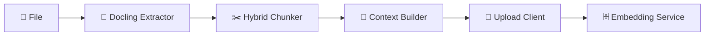
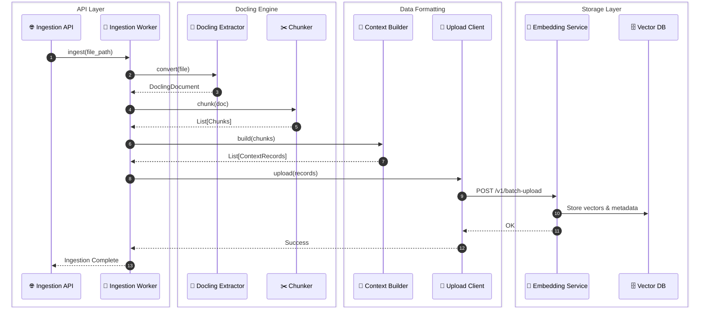

## Data Ingestion Service

This service handles the document ingestion pipeline, converting raw documents into structured, contextualized text chunks and uploading them to the vector database for RAG (Retrieval-Augmented Generation).

## Project Structure

```
data-ingestion/             # 📥 Ingestion pipeline (documents → vectors)
├── __init__.py
├── main.py                 # FastAPI entrypoint (upload / trigger ingestion)
├── ingestion/
│   ├── __init__.py
│   ├── extract_docling.py  # Main extractor using Docling (PDF, TXT, DOCX, etc.)
│   ├── context_builder.py  # Formats chunks and adds consistent metadata
│   ├── chunker.py          # Docling-based HybridChunker with contextualization
│   ├── indexer.py          # Placeholder for direct indexing (currently via Upload)
│   └── upload.py           # Sends formatted chunks to Embedding Service
├── workers/                # background task runner
│   ├── ingestion_worker.py # orchestrates the Docling pipeline
│   └── __init__.py
├── db/                    # metadata DB access
│   ├── __init__.py
│   └── ...
├── embedding/             # client adapter
│   ├── __init__.py
│   └── client.py          # client for calling embedding service
└── config.py             # configuration and env variables
```

---

## Ingestion Flow

The ingestion pipeline is powered by **Docling** for unified document processing:

1. **Extraction**: `DoclingExtractor.convert(file_path)` - Uses Docling to convert documents into a structured `DoclingDocument`. Supports PDF, DOCX, XLSX, CSV, HTML, and TXT (internally mapped to MD).
2. **Chunking**: `Chunker.chunk(doc)` - Uses Docling's `HybridChunker` to create contextualized chunks, preserving document structure and hierarchy.
3. **Context Building**: `ContextBuilder.build(chunks, file_path)` - Formats chunks into `ContextRecord`s and attaches consistent metadata (department, team, project, etc.). Specialized handling for structured data (1 record per sheet/CSV).
4. **Uploading**: `Upload.upload(contexts)` - Batch uploads formatted records to the Embedding Service for vectorization and storage in Qdrant.

---



---

### Ingestion Sequence

