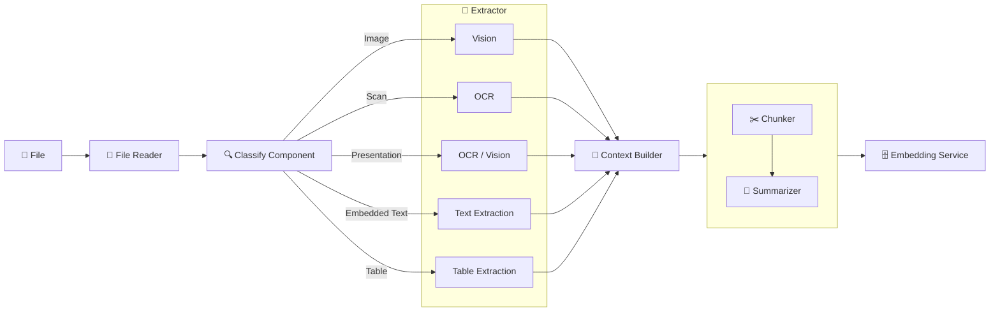
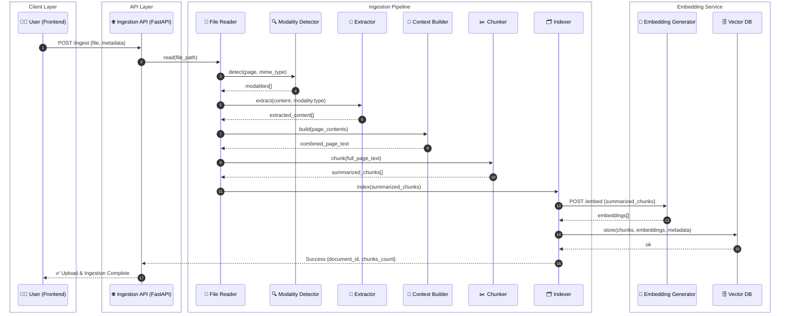

## Project Structure

```
data-ingestion/             # 📥 Ingestion pipeline (documents → vectors)
├── __init__.py
├── main.py                 # FastAPI entrypoint (upload / trigger ingestion)
├── ingestion/
│   ├── __init__.py
│   ├── file_reader.py      # read file, detect mime type and split into pages
│   ├── modality.py         # detect content types in each page (text/image/table)
│   ├── extractor.py        # extract content from modality.content by modality.type
│   ├── context_builder.py  # combine all modalities in a page into single text
│   ├── chunker.py          # recursive text chunking and summarize each chunk
│   ├── indexer.py          # create vector embeddings and save metadata to database for each chunk
│   └── storage.py          # save artifacts to MinIO/S3
├── workers/                # background task runner (RQ/Celery)
│   ├── ingestion_worker.py # main worker that runs ingestion pipeline
│   └── __init__.py
├── db/                    # owns write access to metadata DB
│   ├── __init__.py
│   ├── database.py         # database connection and session management
│   ├── document.py         # document model and operations
│   ├── page.py            # page model and operations
│   └── job.py             # ingestion job model and operations
├── embedding/             # client adapter (local or HTTP)
│   ├── __init__.py
│   └── client.py          # client for calling embedding service
└── config.py             # configuration settings and environment variables
```

---

## Ingestion Flow

The ingestion pipeline processes documents through the following stages:

1. **File Reading**: `file_reader.read(file_path)` - Reads file, detects MIME type, and splits into pages
2. **For each page**:
   - **Modality Detection**: `modality.detect(page, mime_type)` - Detects content types in the page (text/image/table)
   - **For each modality**:
     - **Content Extraction**: `extractor.extract(modality.content, modality.type)` - Extracts content from the modality (text/OCR/image caption/table parsing)
   - **Context Building**: `context_builder.build(page_contents)` - Combines all modality contents in a page into a single text
   - **Chunking**: `chunker.chunk(full_page_text)` - Recursively chunks the text and summarizes each chunk
   - **For each chunk**:
     - **Indexing**: `indexer.index(chunk)` - Creates vector embeddings and saves metadata to database

---



---

### Document Upload Flow

