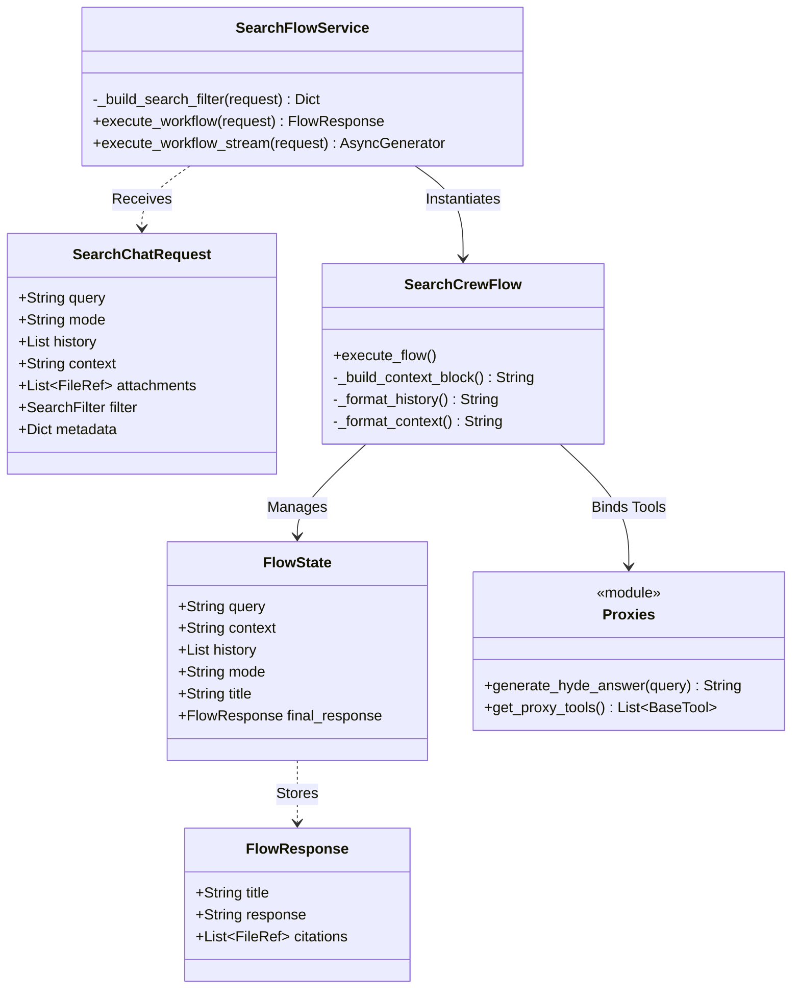

# Search Flow Class Diagram

This diagram outlines the core data models (Pydantic) and service classes within the Search Flow service, showing how requests are transformed into state and eventually into responses.

