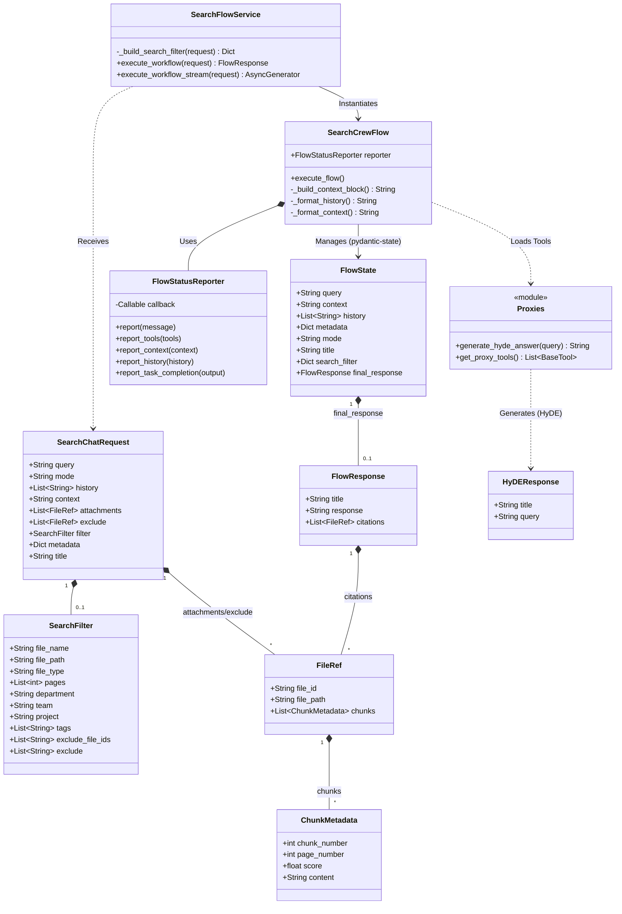

# Search Flow Class Diagram

This diagram outlines the core data models (Pydantic), services, and orchestration classes within the Search Flow service.

```mermaid
classDiagram
    class SearchChatRequest {
        +String query
        +String mode
        +List~String~ history
        +String context
        +List~FileRef~ attachments
        +List~FileRef~ exclude
        +SearchFilter filter
        +Dict metadata
        +String title
    }

    class SearchFilter {
        +String file_name
        +String file_path
        +String file_type
        +List~int~ pages
        +String department
        +String team
        +String project
        +List~String~ tags
        +List~String~ exclude_file_ids
        +List~String~ exclude
    }

    class FileRef {
        +String file_id
        +String file_path
        +List~ChunkMetadata~ chunks
    }

    class ChunkMetadata {
        +int chunk_number
        +int page_number
        +float score
        +String content
    }

    class FlowState {
        +String query
        +String context
        +List~String~ history
        +Dict metadata
        +String mode
        +String title
        +Dict search_filter
        +FlowResponse final_response
    }

    class FlowResponse {
        +String title
        +String response
        +List~FileRef~ citations
    }

    class HyDEResponse {
        +String title
        +String query
    }

    class SearchFlowService {
        -_build_search_filter(request) Dict
        +execute_workflow(request) FlowResponse
        +execute_workflow_stream(request) AsyncGenerator
    }

    class SearchCrewFlow {
        +FlowStatusReporter reporter
        +execute_flow()
        -_build_context_block() String
        -_format_history() String
        -_format_context() String
    }

    class FlowStatusReporter {
        -Callable callback
        +report(message)
        +report_tools(tools)
        +report_context(context)
        +report_history(history)
        +report_task_completion(output)
    }

    class Proxies {
        <<module>>
        +generate_hyde_answer(query) String
        +get_proxy_tools() List~BaseTool~
    }

    SearchChatRequest "1" *-- "0..1" SearchFilter
    SearchChatRequest "1" *-- "*" FileRef : attachments/exclude
    FileRef "1" *-- "*" ChunkMetadata : chunks
    FlowResponse "1" *-- "*" FileRef : citations
    
    SearchFlowService ..> SearchChatRequest : Receives
    SearchFlowService --> SearchCrewFlow : Instantiates
    SearchCrewFlow --> FlowState : Manages (pydantic-state)
    SearchCrewFlow *-- FlowStatusReporter : Uses
    FlowState "1" *-- "0..1" FlowResponse : final_response
    
    SearchCrewFlow ..> Proxies : Loads Tools
    Proxies ..> HyDEResponse : Generates (HyDE)
```
