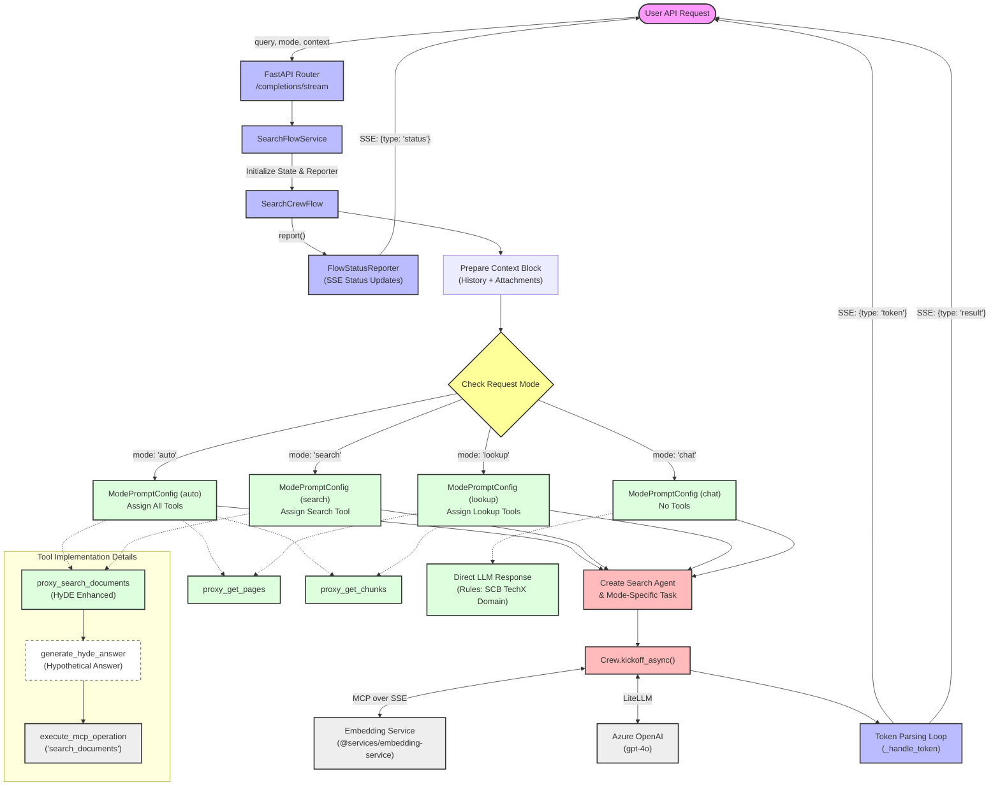

# Search Flow Architecture & Mode Selection

This diagram illustrates how a user request is processed, focusing on how the `mode` parameter drives tool assignment, prompt configuration (Rules & Core Job), and the internal execution flow.

