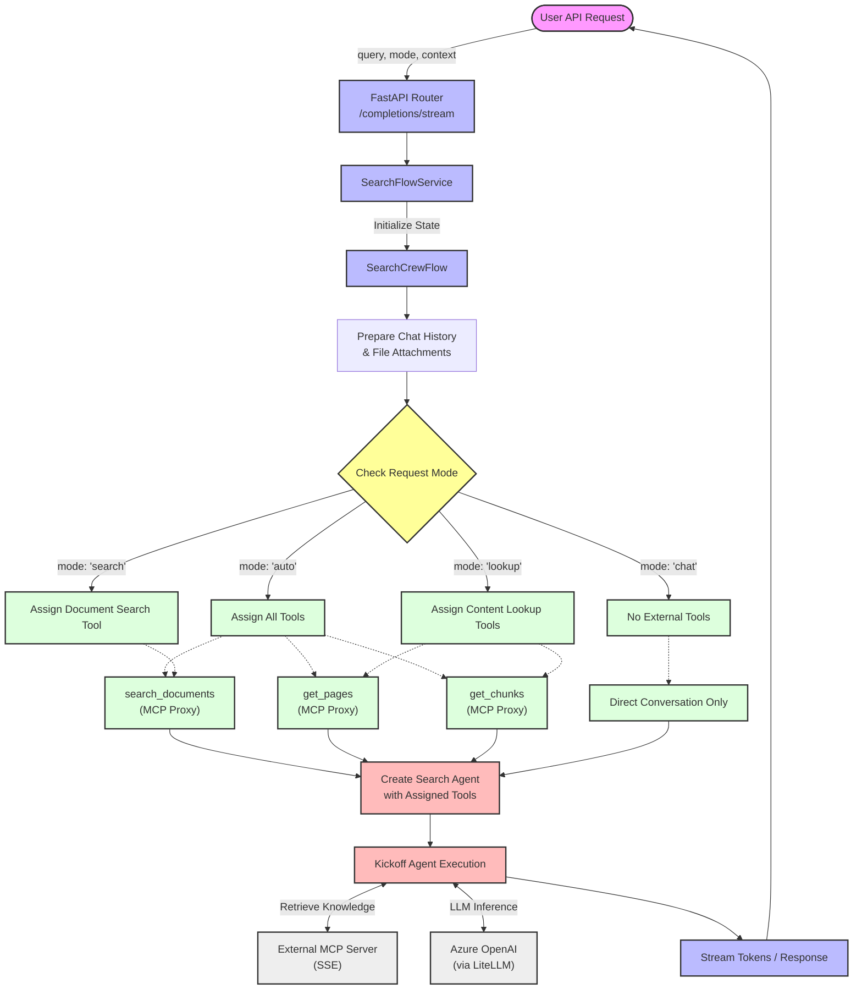

# Search Flow Architecture & Mode Selection

This diagram illustrates how a user request is processed, and specifically how the `mode` parameter determines which MCP tools are assigned to the CrewAI Agent.

