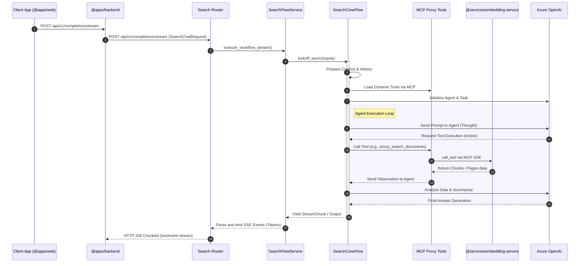

# Search Flow Sequence Diagram

This diagram illustrates the sequence of operations when a streaming request is made to the Search Flow service, showing the interaction between the backend, the CrewAI flow, the external MCP tools, and the LLM.

