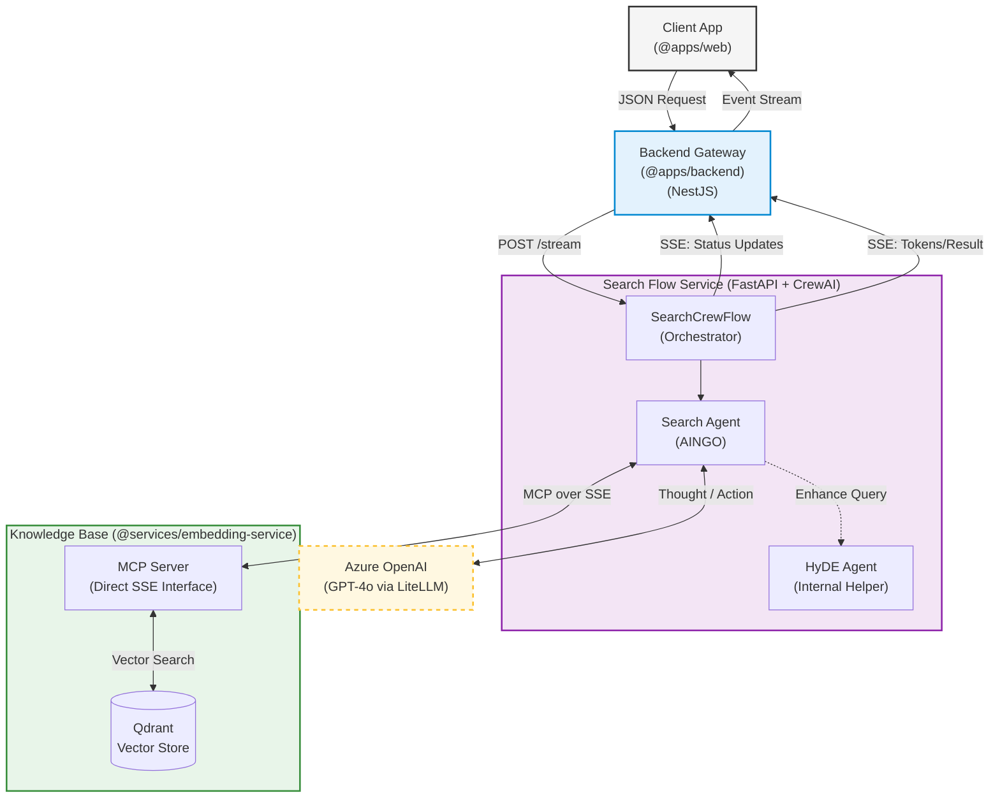

# Search Flow System Architecture

This diagram illustrates the high-level system boundaries and the specialized interactions between the stateless Search Flow engine and its core dependencies.

```mermaid
flowchart TD
    %% Define Components
    Client["Client App\n(@apps/web)"]:::client
    Backend["Backend Gateway\n(@apps/backend)\n(NestJS)"]:::backend
    
    subgraph SearchFlowEngine ["Search Flow Service (FastAPI + CrewAI)"]
        Flow["SearchCrewFlow\n(Orchestrator)"]
        Agent["Search Agent\n(AINGO)"]
        HyDE["HyDE Agent\n(Internal Helper)"]
    end
    
    subgraph KnowledgeBase ["Knowledge Base (@services/embedding-service)"]
        Tools["MCP Server\n(Direct SSE Interface)"]
        VectorDB[("Qdrant\nVector Store")]
    end
    
    LLM["Azure OpenAI\n(GPT-4o via LiteLLM)"]:::external

    %% Define Relationships
    Client -->|"JSON Request"| Backend
    Backend -->|"POST /stream"| Flow
    
    Flow --> Agent
    Agent -.->|"Enhance Query"| HyDE
    Agent <-->|"Thought / Action"| LLM
    
    Agent <-->|"MCP over SSE"| Tools
    Tools <-->|"Vector Search"| VectorDB
    
    Flow -- "SSE: Status Updates" --> Backend
    Flow -- "SSE: Tokens/Result" --> Backend
    Backend -- "Event Stream" --> Client
    
    %% Styling
    classDef client fill:#f5f5f5,stroke:#333,stroke-width:2px;
    classDef backend fill:#e3f2fd,stroke:#0288d1,stroke-width:2px;
    classDef search fill:#f3e5f5,stroke:#8e24aa,stroke-width:2px;
    classDef embed fill:#e8f5e9,stroke:#388e3c,stroke-width:2px;
    classDef external fill:#fff8e1,stroke:#fbc02d,stroke-width:2px,stroke-dasharray: 5 5;

    class SearchFlowEngine search;
    class KnowledgeBase embed;
    class LLM external;
```
