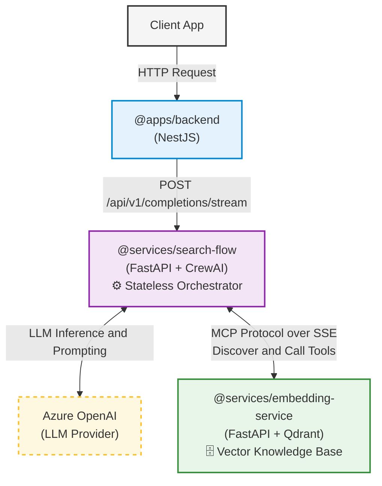

# Search Flow System Architecture

This diagram shows the system boundaries and how the stateless Search Flow service interacts with the user-facing backend, the embedding service (acting as the knowledge base), and the Azure OpenAI LLM.

